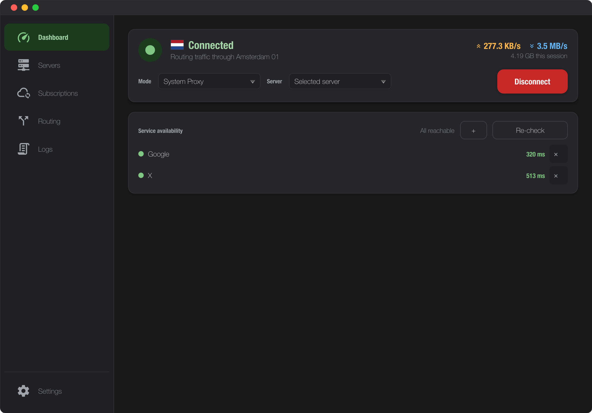
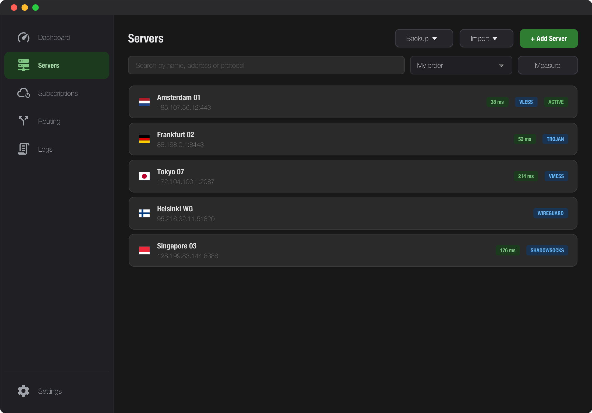
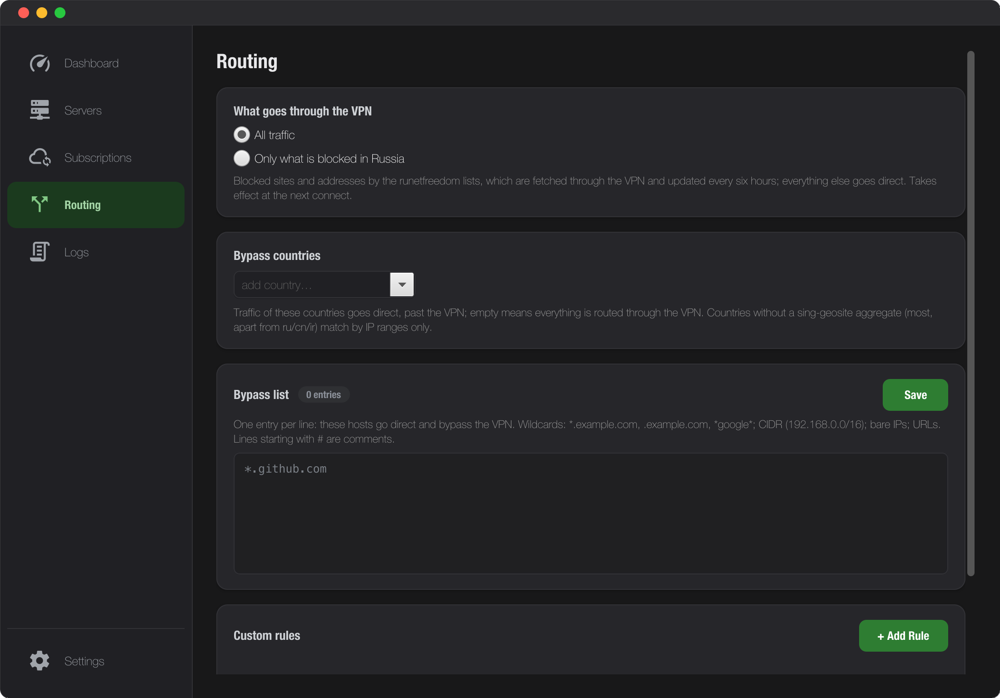
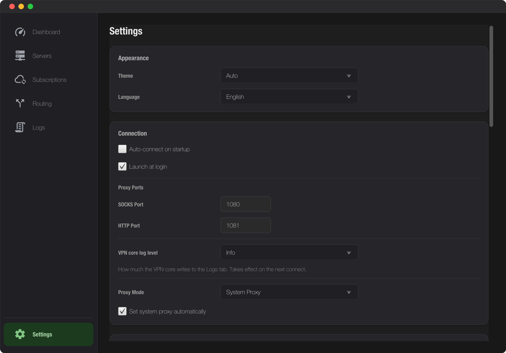

# Tunl

<p align="center">
  
</p>

<p align="center">
  <a href="https://github.com/dbelokursky/tunl/actions/workflows/build.yml"></a>
  <a href="https://github.com/dbelokursky/tunl/releases/latest"></a>
  <a href="https://github.com/dbelokursky/tunl/releases"></a>
  <a href="https://github.com/dbelokursky/tunl/releases/latest"></a>
  <a href="LICENSE"></a>
</p>

<p align="center">🇬🇧 <a href="README.md">English</a> · 🇷🇺 <b>Русский</b></p>

**Tunl** — кроссплатформенный десктоп-клиент (macOS / Windows / Linux) для
VLESS, VMess, Trojan, Shadowsocks, Hysteria2 и WireGuard на JavaFX — оборачивает
[sing-box](https://github.com/SagerNet/sing-box) и даёт ему удобный GUI с живой
статистикой трафика, импортом share-ссылок, подписками, правилами маршрутизации
и иконкой в трее/меню-баре.

<p align="center">
  
</p>

---

## Скачать

Готовые установщики — на странице
[**Releases**](https://github.com/dbelokursky/tunl/releases/latest):

| ОС | Файл | Примечание |
|---|---|---|
| macOS (Apple Silicon) | `tunl_x.y.z.dmg` | |
| Windows 10/11 (x64) | `tunl_x.y.z.msi` | ставится per-user, без прав администратора |
| Debian/Ubuntu (amd64) | `tunl_x.y.z_amd64.deb` | |
| Debian/Ubuntu (arm64) | `tunl_x.y.z_arm64.deb` | Raspberry Pi 5 и другие ARM-машины |

Сборка самого свежего мержа в `main` (может быть сырой) — в prerelease
[**dev-latest**](https://github.com/dbelokursky/tunl/releases/tag/dev-latest).

---

## Установка

### macOS

Сборки пока **не подписаны** сертификатом Apple Developer, поэтому при первом
запуске Gatekeeper заблокирует приложение. Разблокируется один раз через
системные настройки:

1. Открой DMG и перетащи **Tunl** в папку **Программы** (Applications).
2. Запусти приложение. macOS сообщит, что не может проверить его на
   вредоносное ПО — нажми **«Готово»** (Done), *не* «Переместить в Корзину».
3. Открой **Системные настройки → Конфиденциальность и безопасность**
   (System Settings → Privacy & Security).
4. Прокрути до раздела **«Безопасность»** (Security) — там будет сообщение
   «Приложение "Tunl" было заблокировано для защиты Mac».
5. Нажми **«Все равно открыть»** (Open Anyway) и подтверди паролем или Touch ID.
6. В появившемся диалоге нажми **«Открыть»** (Open). Готово — дальше
   приложение запускается как обычно.

<!-- TODO(screenshots): диалог Gatekeeper и панель «Конфиденциальность и
     безопасность» с кнопкой «Все равно открыть» — Phase 3 плана -->

Нюансы:

- Процедуру придётся повторить после **каждого обновления** приложения — пока
  сборки не подписаны, macOS блокирует каждый новый бинарь заново.
- На macOS 13–14 есть путь короче: правый клик по приложению в Программах →
  **«Открыть»** → «Открыть». На macOS 15+ этот трюк для неподписанных
  приложений больше не работает — только через настройки.
- Эквивалент для терминала (снимает карантинный атрибут):

  ```bash
  xattr -d com.apple.quarantine "/Applications/Tunl.app"
  ```

Либо через [Homebrew](https://brew.sh), когда tap настроен (см.
[docs/DISTRIBUTION.md](docs/DISTRIBUTION.md)):

```bash
brew install --cask dbelokursky/tap/tunl
```

### Windows

1. Запусти MSI. SmartScreen покажет «Система Windows защитила ваш компьютер» —
   нажми **«Подробнее»** (More info) → **«Выполнить в любом случае»**
   (Run anyway).
2. Дальше обычный мастер установки. Приложение ставится per-user — права
   администратора не нужны.

Единственное, где Windows попросит повышение прав, — UAC-промпт при
подключении в режиме TUN.

### Linux (Debian/Ubuntu)

```bash
sudo apt install ./tunl_*.deb
```

Приложение ставится в `/opt/tunl` и появляется в меню приложений
(категория «Интернет»/Network).

На Arch-дистрибутивах доступен пакет [AUR](https://aur.archlinux.org) (см.
[docs/DISTRIBUTION.md](docs/DISTRIBUTION.md)):

```bash
yay -S tunl-bin
```

### Переход с VLESS Client (1.4.x и старее)

В версии 1.5.0 приложение переименовано в Tunl. Серверы, подписки, правила
маршрутизации и сохранённые пароли переезжают сами — сменилось только имя
приложения, а не место хранения данных.

| ОС | Что происходит | Что сделать |
|---|---|---|
| Windows | MSI обновляет установленную версию на месте | ничего |
| macOS | `Tunl.app` встанет **рядом** со старым `VLESS Client.app` | удалить старое приложение, когда Tunl заработает |
| Linux | apt видит `tunl` как новый пакет, а не обновление | после установки — `sudo apt remove vless-client` |

---

## Первое подключение

1. **Добавь сервер.** Вкладка **Servers** → **Import Link** → вставь ссылку
   `vless://…` / `vmess://…` / `trojan://…` / `ss://…` от своего провайдера —
   поля заполнятся сами. (Или **Add Server** и заполни форму вручную; третий
   путь — вкладка **Subscriptions** с URL подписки, список серверов будет
   обновляться автоматически.)
2. **Проверь активный сервер** — клик по строке сервера вешает на него бейдж
   **ACTIVE**; именно он используется при подключении.
3. **Нажми Connect** на вкладке **Dashboard** (или `⌘K` / `Ctrl+K`).
   Зелёный индикатор — подключено, оранжевый — подключается, красный — ошибка
   (смотри вкладку **Logs**).
4. **Проверь IP**: открой [2ip.ru](https://2ip.ru) или выполни
   `curl ifconfig.me` — адрес должен смениться на адрес сервера.

### Какой режим выбрать

Выпадающий список **Mode** на Dashboard:

| | **System Proxy** (по умолчанию) | **TUN** |
|---|---|---|
| Что идёт через туннель | приложения, уважающие системный прокси: браузеры, большинство CLI | **весь** трафик системы, включая то, что прокси игнорирует |
| Права | не нужны | нужны (см. ниже) |
| Когда выбирать | обычный сёрфинг | мессенджеры, игры, системные сервисы |

Что просит TUN на каждой ОС:

| ОС | Права для TUN |
|---|---|
| macOS | sudo-NOPASSWD правило (пароль один раз) или osascript-промпт на каждый Connect |
| Windows | UAC-промпт на каждый Connect |
| Linux | одноразовый `setcap` через PolicyKit (дальше без промптов) или pkexec-промпт на Connect |

---

## Как пользоваться

### Серверы

<p align="center">
  
</p>

Поиск фильтрует сразу по имени, адресу, порту и протоколу. Сортировка — свой
порядок, по имени, по протоколу или сначала быстрые; **Замерить** заполняет
задержку для того, что сейчас показывает поиск. Пока туннель поднят, замер
идёт *через* прокси, а не до его адреса, — сервер, который отвечает, но не
работает, встаёт на своё место.

Клик по серверу делает его активным; Cmd/Shift-клик набирает выделение, а
удаление спрашивает один раз за всю пачку. Правый клик — **Изменить**,
**Дублировать**, **Скопировать ссылку**, **Удалить**.

### Подписки

Вкладка **Subscriptions**: добавь URL — список серверов подтянется и будет
периодически пересинхронизироваться.

### Маршрутизация

<p align="center">
  
</p>

Вкладка **Routing** — правила маршрутизации: geoip, geosite, domain, ruleset.

### Мониторинг

**Dashboard** показывает живую статистику: скорость Upload/Download, суммарный
трафик. **Logs** — стрим логов sing-box с фильтром по уровню.

### Трей / меню-бар

Иконка даёт быстрые действия без открытия окна: Show window,
Connect/Disconnect, выбор сервера, Quit. Закрытие главного окна (`⌘W`, красный
кружок) **не** завершает приложение — оно живёт в трее; выход — **Quit** в трее
или `⌘Q`.

| ОС | Где |
|---|---|
| macOS | меню-бар |
| Windows | системный трей |
| Linux | там, где трей есть (KDE/XFCE/…); на стоковом GNOME трея нет — закрытие окна завершает приложение |

Цвет иконки отвечает на вопрос «доходит ли трафик наружу», а не «запустилось ли
ядро»: пока проверка сервисов не ответила, иконка остаётся жёлтой.

| Цвет | Значение |
|---|---|
| ⚪️ Серый | Отключено |
| 🟠 Жёлтый | Подключение, проверка или доступна лишь часть сервисов |
| 🟢 Зелёный | Подключено, и все проверяемые сервисы доступны |
| 🔴 Красный | Не удалось запустить или туннель поднят, но трафик не проходит |

Если проверка сервисов выключена, проверять нечего — подключённый туннель
просто зелёный.

### Автостарт

| ОС | Механизм |
|---|---|
| macOS | LaunchAgent |
| Windows | реестр Run (нативный exe) |
| Linux | XDG autostart (`~/.config/autostart`) |

### Обновление ядра sing-box

**Settings → About → «Проверить обновления»** — патчи ядра прилетают без
релиза приложения (в пределах минорной ветки, с валидацией `sing-box check`
и откатом при неудаче).

### Горячие клавиши

`⌘` на macOS = `Ctrl` на Windows/Linux.

| Hotkey | Действие                                |
|--------|-----------------------------------------|
| `⌘K`   | Connect / Disconnect                    |
| `⌘N`   | Add server                              |
| `⌘1`   | Dashboard                               |
| `⌘2`   | Servers                                 |
| `⌘3`   | Subscriptions                           |
| `⌘4`   | Routing                                 |
| `⌘5`   | Logs                                    |
| `⌘,`   | Settings                                |
| `⌘W`   | Hide window (продолжает работать в tray)|
| `⌘Q`   | Quit                                    |

### Настройки

<p align="center">
  
</p>

| Поле                     | Описание                                              |
|--------------------------|-------------------------------------------------------|
| Theme                    | Light / Dark                                          |
| Language                 | Russian / English                                     |
| Mixed port               | Порт SOCKS/HTTP прокси (по умолчанию `2080`)          |
| Clash API port           | Порт для статистики трафика (по умолчанию `9090`)     |
| Auto-connect on start    | Подключаться к активному серверу при запуске          |
| Check for updates        | Периодическая проверка обновлений приложения          |
| Allow LAN                | Разрешить коннекты к прокси из локальной сети         |

Где живут данные (`settings.json`, `servers.json`, `subscriptions.json`,
`routing.json`, кэш бинаря `bin/`):

| ОС | Путь |
|---|---|
| macOS | `~/Library/Application Support/VlessClient` |
| Windows | `%APPDATA%\VlessClient` |
| Linux | `~/.local/share/vless-client` |

В путях осталось старое имя приложения (до переименования оно называлось
«VLESS Client»). Так сделано намеренно: благодаря этому обновление находит
серверы, подписки и сохранённые пароли там же, где они лежали, — переносить
вручную ничего не нужно.

### System Proxy по ОС

| ОС | Поведение |
|---|---|
| macOS | системные настройки прокси переключаются автоматически |
| Windows | автоматически (WinINET) |
| Linux | автоматически на GNOME; на других DE — прокси вручную (локальные порты работают везде) или TUN |

---

## Траблшутинг

**macOS: «Приложение заблокировано» / «Apple не может проверить»**
Это Gatekeeper и неподписанная сборка — пройди
[шаги установки](#macos): Системные настройки → Конфиденциальность и
безопасность → «Все равно открыть».

**macOS: после обновления приложение снова заблокировано**
Так и будет, пока сборки не подписаны, — каждый новый бинарь проходит
Gatekeeper заново. Процедура та же.

**Connect кнопка недоступна**
Нет активного сервера — на вкладке Servers кликни по серверу, чтобы появился
бейдж **ACTIVE**.

**«Process exited unexpectedly (code N)»**
sing-box упал. Причина — во вкладке **Logs**. Частые: неверный UUID,
неподходящий transport, недоступный сервер, конфликт портов.

**TUN-режим запрашивает пароль каждый раз**
Создание TUN-интерфейса требует прав root/администратора: macOS показывает
osascript-промпт (или настрой sudo-NOPASSWD — тогда пароль один раз),
Windows — UAC, Linux — pkexec (или одноразовый `setcap`).

**Порт 2080 занят**
Смени `Mixed port` в настройках на свободный.

**Linux: нет иконки в трее**
На стоковом GNOME трея нет (нужно расширение вроде AppIndicator), закрытие
окна завершает приложение. В KDE/XFCE трей работает из коробки.

**«sing-box binary not found» при запуске**
Актуально для запуска из исходников без бандлинга — см.
[раздел «Разработка»](#если-бандл-недоступен). В установщиках (DMG/MSI/DEB)
sing-box уже внутри.

---

## Разработка

### Быстрый старт

```bash
git clone https://github.com/dbelokursky/tunl.git
cd tunl
mvn clean javafx:run
```

При первой сборке Maven автоматически скачает `sing-box` (версия пиннится в
[singbox.properties](src/main/resources/singbox.properties)) под ОС и
архитектуру машины сборки в `target/classes/native/{os}-{arch}/` с проверкой
SHA-256. Бинарь бандлится в jar и извлекается при первом запуске. Бандлится
только архитектура хоста: jpackage собирает приложение под одну архитектуру,
так что DMG, собранный на Apple Silicon, всё равно не смог бы запустить
Intel-ядро.

### Если бандл недоступен

Если приложение запущено без build-time бандлинга (например, голый jar без
`generate-resources`), при старте появится модальный диалог, который скачает
`sing-box` с GitHub Releases и закэширует в
`~/Library/Application Support/VlessClient/bin/sing-box`. Загрузка защищена
SHA-256 проверкой.

Если нет сети — в диалоге-установщике есть подсказка:

```bash
brew install sing-box
```

После ручной установки перезапусти приложение или нажми **Retry download** в
оранжевом баннере на Dashboard — оно подхватит бинарь из стандартных
Homebrew-путей (`/opt/homebrew/bin`, `/usr/local/bin`) или из `$PATH`.

### Требования

- JDK 25
- Maven 3.9+
- bash + curl + tar (стандартно для macOS) — нужны для `generate-resources`
  чтобы скачать sing-box

### Команды

```bash
mvn clean verify            # полная проверка: checkstyle, тесты, покрытие, SpotBugs
mvn clean javafx:run        # запуск в dev-режиме
mvn clean package           # сборка shade-jar (с бандлом sing-box)
mvn test                    # только тесты
mvn test -Dtest=SingBoxInstallerTest   # один тест-класс
mvn validate                # checkstyle
```

### Регенерация иконки

```bash
java --source 25 scripts/GenerateAppIcon.java
```

Генерирует PNG 16/32/64/128/256/512/1024 в `src/main/resources/icons/`.
Правь дизайн в [GenerateAppIcon.java](scripts/GenerateAppIcon.java).

### Обновление sing-box

Версия и SHA-256 живут в одном файле —
[singbox.properties](src/main/resources/singbox.properties). Его читают
pom.xml (properties-maven-plugin), [scripts/bundle-singbox.sh](scripts/bundle-singbox.sh)
и SingBoxInstaller, так что разъехаться они не могут. Бамп — одна команда:

```bash
scripts/bump-singbox.sh 1.13.14   # качает tarballs, сверяет SHA-256 с digest из GitHub API, обновляет properties
mvn clean verify -Psmoke          # полные тесты + smoke на реальном бинарнике
```

Smoke-профиль (`-Psmoke`,
[SingBoxRealBinarySmokeTest](src/test/java/com/vlessclient/service/SingBoxRealBinarySmokeTest.java))
прогоняет реальный бинарник: точное совпадение версии с пином,
`sing-box check` для всех протоколов × режимов × роутинг-пресетов и живой
`run` с проверкой clash_api и http-inbound. CI гоняет его на каждом PR и
перед сборкой установщиков.

Минорные обновления sing-box (1.13 → 1.14) ломают схему конфига — сначала
мигрируй [SingBoxConfigGenerator.java](src/main/java/com/vlessclient/service/SingBoxConfigGenerator.java)
по [миграционному гайду](https://sing-box.sagernet.org/migration/), потом бампай.

### Структура

```
src/main/java/com/vlessclient/
├── app/            # Launcher, VlessClientApp, ServiceLocator, I18n, AppVersion
├── model/          # POJOs: ServerConfig, AppSettings, Subscription, Routing...
├── service/        # SingBoxEngine, SingBoxInstaller, ConfigStore,
│                   # SubscriptionService, RoutingService, LatencyTester,
│                   # TrafficMonitor, TrayIconService, UpdateManager, ...
└── ui/view/        # JavaFX контроллеры для каждой вкладки

src/main/resources/
├── fxml/           # FXML-разметка
├── css/            # light.css, dark.css
├── i18n/           # messages_en.properties, messages_ru.properties
└── icons/          # app-icon-{16..1024}.png

scripts/
├── bundle-singbox.sh       # скачивает sing-box на этапе mvn generate-resources
├── package-dmg.sh          # DMG (macOS), общий для build.yml и release.yml
├── package-windows.ps1     # MSI (Windows)
├── package-linux.sh        # DEB (Linux)
├── linux-qa.sh             # Linux-QA одной командой в Docker (сборка+тесты+скриншот UI)
├── linux-vm-qa.sh          # desktop-VM QA: TUN teardown, tray, GNOME proxy
└── GenerateAppIcon.java    # генератор иконки приложения
```

### Возможности (полный список)

- **Протоколы:** VLESS, VMess, Trojan, Shadowsocks, Hysteria2, WireGuard (через sing-box)
- **Транспорты:** TCP, WebSocket, gRPC, HTTP/2, QUIC
- **TLS / Reality / XTLS-Vision**
- **Режимы:** System Proxy, TUN
- **Подписки** — автообновление списков серверов по URL
- **Routing rules** — geoip, geosite, domain, ruleset
- **Share-ссылки** — импорт/экспорт `vless://`, `vmess://`, `trojan://`, `ss://`
- **Латентность** — замер пинга до всех серверов одной кнопкой
- **Трафик** — живая статистика через Clash API
- **Трей/меню-бар**, **хоткеи**, светлая/тёмная **темы**, **русский/английский**

---

## Лицензия

[Apache-2.0](LICENSE). Копирайт и атрибуция — в [NOTICE](NOTICE).

sing-box лицензируется под
[GPL-3.0](https://github.com/SagerNet/sing-box/blob/main/LICENSE); установщики
и dev-сборки бандлят его бинарь без изменений, отдельным процессом,
вызываемым по документированному интерфейсу. Забандленная версия закреплена в
[`singbox.properties`](src/main/resources/singbox.properties), исходники
доступны в апстриме.
